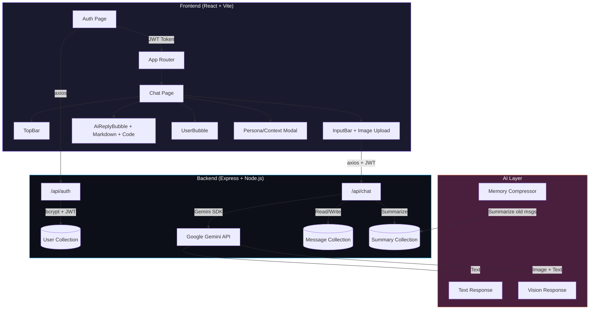

<h1 align="center">KLIQ AI - Chat Assistant</h1>

<p align="center">
  <strong>Full-stack AI chat app using MERN stack + Google Gemini API</strong>
</p>

<p align="center">
  
  
  
  
  
  
</p>

<p align="center">
  <a href="#features">Features</a> •
  <a href="#architecture">Architecture</a> •
  <a href="#getting-started">Getting Started</a> •
  <a href="#tech-stack">Tech Stack</a> •
  <a href="#api-endpoints">API Endpoints</a> •
  <a href="#project-structure">Project Structure</a>
</p>

---

## Features

<table>
  <tr>
    <td width="50%">

### Chat with Gemini

- Multi-turn conversations using **Gemini 2.5 Flash**
- Model fallback (tries 2.5 Flash, then 2.5 Pro, then 2.0 Flash)
- Chat history saved in **MongoDB**
- Old messages get compressed into summaries so context doesn't overflow

</td>
    <td width="50%">

### Image Input

- Attach images and ask Gemini questions about them
- Preview the image before sending
- Base64 encoded, 10MB max

</td>
  </tr>
  <tr>
    <td width="50%">

### Persona System

- Preset modes: Mentor, Pirate, Sarcastic, Normal
- Or type your own custom context/instructions
- Context stays in the session only, not saved to DB

</td>
    <td width="50%">

### Text-to-Speech

- Each AI reply has a speaker button
- Uses the browser's `SpeechSynthesis` API
- Strips code blocks before reading out loud

</td>
  </tr>
  <tr>
    <td width="50%">

### Code Blocks

- Syntax highlighted using `react-syntax-highlighter`
- Dark theme, language label, copy button
- Inline code gets styled separately

</td>
    <td width="50%">

### Auth

- JWT signup/login
- Passwords hashed with bcrypt
- Each user has their own chat history
- 7-day token expiry

</td>
  </tr>
</table>

---

## Architecture



### How Memory Compression Works

When a user's message count goes above 10, the backend compresses the oldest 5 messages into a summary using Gemini, saves that summary, and deletes the old messages. This keeps the context window small while still remembering what was talked about earlier.

```
1. User sends message -> saved to MongoDB
2. If message count > 10:
   a. Take 5 oldest messages
   b. Ask Gemini to summarize them
   c. Save summary, delete old messages
3. Build context = System prompt + Persona + Summary + Recent messages
4. Send to Gemini, get reply, save it
```

---

## Getting Started

### What you need

| Tool | Version |
|------|---------|
| Node.js | v18+ |
| npm | v9+ |
| MongoDB Atlas | Free tier is fine |
| Gemini API Key | [Get one here](https://aistudio.google.com/apikey) |

### 1. Clone

```bash
git clone https://github.com/Arsh1255/KLIQ-AI-Chatbot.git
cd KLIQ-AI-Chatbot
```

### 2. Backend setup

```bash
cd backend
npm install
```

Create a `.env` file (see `.env.example`):

```env
PORT=5000
MONGO_URI=mongodb+srv://<username>:<password>@cluster.mongodb.net/kliq-ai
GEMINI_API_KEY=your_key_here
JWT_SECRET=some_random_secret
```

Start the server:

```bash
npm run dev    # with auto-restart
npm start      # or just run it
```

### 3. Frontend setup

```bash
cd frontend
npm install
npm run dev
```

### 4. Use it

Go to `http://localhost:5173`, create an account, start chatting.

---

## Tech Stack

<table>
  <tr>
    <th>Layer</th>
    <th>Technology</th>
    <th>What it does</th>
  </tr>
  <tr>
    <td rowspan="7"><strong>Frontend</strong></td>
    <td>React 19</td>
    <td>UI</td>
  </tr>
  <tr>
    <td>Vite 7</td>
    <td>Dev server + bundler</td>
  </tr>
  <tr>
    <td>Tailwind CSS 4</td>
    <td>Styling</td>
  </tr>
  <tr>
    <td>Framer Motion</td>
    <td>Animations</td>
  </tr>
  <tr>
    <td>React Markdown</td>
    <td>Rendering AI responses</td>
  </tr>
  <tr>
    <td>React Syntax Highlighter</td>
    <td>Code blocks</td>
  </tr>
  <tr>
    <td>Lucide React</td>
    <td>Icons</td>
  </tr>
  <tr>
    <td rowspan="5"><strong>Backend</strong></td>
    <td>Node.js + Express 5</td>
    <td>API server</td>
  </tr>
  <tr>
    <td>MongoDB + Mongoose 9</td>
    <td>Database</td>
  </tr>
  <tr>
    <td>Google Generative AI SDK</td>
    <td>Gemini integration</td>
  </tr>
  <tr>
    <td>JSON Web Tokens</td>
    <td>Auth</td>
  </tr>
  <tr>
    <td>bcryptjs</td>
    <td>Password hashing</td>
  </tr>
</table>

---

## API Endpoints

### Auth

| Method | Endpoint | Description | Auth Required |
|--------|----------|-------------|---------------|
| POST | `/api/auth/signup` | Create account | No |
| POST | `/api/auth/login` | Get JWT token | No |

### Chat

| Method | Endpoint | Description | Auth Required |
|--------|----------|-------------|---------------|
| POST | `/api/chat` | Send message (text + optional image) | Yes |
| GET | `/api/chat/history` | Get chat history | Yes |
| DELETE | `/api/chat/history` | Clear chat history and memory | Yes |

<details>
<summary><strong>Example: Send a message</strong></summary>

```
Authorization: Bearer <jwt_token>
Content-Type: application/json
```

```json
{
  "message": "Explain recursion with a Python example",
  "image": null,
  "customContext": "You are a coding expert."
}
```

Response:
````json
{
  "reply": "## Recursion\n\nRecursion is when a function calls itself...\n\n```python\ndef factorial(n):\n    if n <= 1:\n        return 1\n    return n * factorial(n - 1)\n```"
}
````
</details>

<details>
<summary><strong>Example: Send with image</strong></summary>

```json
{
  "message": "What's in this image?",
  "image": "data:image/jpeg;base64,/9j/4AAQSkZJR...",
  "customContext": ""
}
```
</details>

---

## Project Structure

```
KLIQ-AI-Chatbot/
├── backend/
│   ├── server.js              # Express entry point
│   ├── .env.example           # Env template
│   ├── middleware/
│   │   └── auth.js            # JWT middleware
│   ├── models/
│   │   ├── User.js
│   │   ├── Message.js
│   │   └── Summary.js
│   └── routes/
│       ├── auth.js            # Signup, Login
│       └── chat.js            # Chat, History, Clear
├── frontend/
│   ├── index.html
│   ├── vite.config.js
│   ├── tailwind.config.js
│   └── src/
│       ├── main.jsx
│       ├── App.jsx            # Auth gate
│       ├── api.js             # Axios + JWT interceptor
│       ├── index.css          # Glassmorphism styles
│       ├── pages/
│       │   ├── Auth.jsx
│       │   ├── Auth.css
│       │   └── Chat.jsx
│       └── components/
│           ├── AiReplyBubble.jsx
│           ├── UserBubble.jsx
│           ├── InputBar.jsx
│           ├── TopBar.jsx
│           └── ContextPopup.jsx
├── .gitignore
└── README.md
```

---

## Design

The UI uses a glassmorphism + dark theme look:
- Dark purple/blue gradient background
- Frosted glass effect on cards (`backdrop-filter: blur`)
- Cyan and purple neon accents
- Poppins for text, Roboto Mono for code
- Animated floating logo in the header
- Pulsing neon glow while the AI is thinking

---

## Config

The backend tries multiple Gemini models in order. If one fails or hits quota, it moves to the next:

```javascript
const MODEL_CANDIDATES = [
  "gemini-2.5-flash",
  "gemini-2.5-pro",
  "gemini-2.0-flash",
  "gemini-flash-latest",
];
```

| Setting | Value | What it does |
|---------|-------|-------------|
| `MEMORY_LIMIT` | 10 | Compress after this many messages |
| `SUMMARY_CHUNK_SIZE` | 5 | How many old messages to compress at once |

---

## Team

- **Abdul Khadar Jamadar ([@Arsh1255](https://github.com/Arsh1255))** - Lead Developer
- **Abdul Azeez ([@AbdulAzeez05](https://github.com/AbdulAzeez05))** - Collaborator

---

## License

MIT
