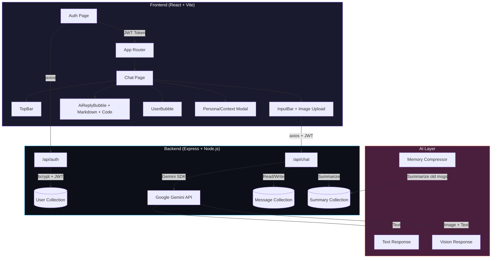

<h1 align="center">🤖 KLIQ AI — Intelligent Chat Assistant</h1>

<p align="center">
  <strong>A full-stack AI-powered chat application built with the MERN stack and Google Gemini API</strong>
</p>

<p align="center">
  
  
  
  
  
  
</p>

<p align="center">
  <a href="#-features">Features</a> •
  <a href="#-architecture">Architecture</a> •
  <a href="#-getting-started">Getting Started</a> •
  <a href="#-tech-stack">Tech Stack</a> •
  <a href="#-api-endpoints">API Endpoints</a> •
  <a href="#-project-structure">Project Structure</a> •
  <a href="#-license">License</a>
</p>

---

## ✨ Features

<table>
  <tr>
    <td width="50%">

### 💬 Intelligent Conversations

- Multi-turn chat with **Google Gemini 2.5 Flash**
- Automatic **model fallback cascade** (2.5 Flash → 2.5 Pro → 2.0 Flash)
- Conversation history persisted in **MongoDB**
- Smart **memory compression** — old messages are summarized to keep context within token limits

</td>
    <td width="50%">

### 🖼️ Multimodal Image Understanding

- Upload images directly in chat
- Gemini analyzes and answers questions about attached images
- Live **image preview** before sending
- Base64 encoding with 10MB upload limit

</td>
  </tr>
  <tr>
    <td width="50%">

### 🎭 Dynamic Persona System

- Switch between preset AI personalities:
  - 🧑‍🏫 **Patient Mentor** — Step-by-step explanations
  - 🏴‍☠️ **Pirate Mode** — Arr, matey!
  - 😏 **Sarcastic Helper** — Helpful with attitude
  - 🤖 **Normal Assistant** — Clean and professional
- Write your own **custom context instructions**
- Context is session-only (not stored in DB)

</td>
    <td width="50%">

### 🔊 Text-to-Speech

- Every AI response has a **speaker button**
- Uses the browser's native `SpeechSynthesis` API
- Code blocks are automatically **stripped** before reading
- Toggle to stop/resume playback

</td>
  </tr>
  <tr>
    <td width="50%">

### 💻 Code Block Rendering

- AI code responses rendered with **syntax highlighting**
- VS Code-inspired dark theme via `react-syntax-highlighter`
- Language label + **one-click copy** button
- Inline code styled with monospace font

</td>
    <td width="50%">

### 🔐 Authentication & User Isolation

- JWT-based **signup/login** system
- Password hashing with **bcrypt** (10 salt rounds)
- Per-user chat history — your messages are private
- 7-day token expiry with auto-attach via Axios interceptors

</td>
  </tr>
</table>

---

## 🏗️ Architecture



### 🧠 Memory Compression Flow

KLIQ AI implements an intelligent **sliding-window memory system** to handle long conversations without exceeding Gemini's context window:

```
1. User sends message → saved to MongoDB
2. Check total message count for user
3. If count > 10 (MEMORY_LIMIT):
   a. Fetch 5 oldest messages
   b. Send to Gemini: "Compress this conversation into a summary"
   c. Merge new summary with existing summary
   d. Delete the 5 oldest messages from DB
4. Build context: System Identity + User Persona + Memory Summary + Recent History
5. Send to Gemini → Get response → Save AI reply to DB
```

This ensures the AI always has context about the full conversation while keeping DB storage and API token usage efficient.

---

## 🚀 Getting Started

### Prerequisites

| Tool                         | Version                                            |
| ---------------------------- | -------------------------------------------------- |
| **Node.js**                  | v18+                                               |
| **npm**                      | v9+                                                |
| **MongoDB Atlas**            | Free tier works                                    |
| **Google AI Studio API Key** | [Get one here](https://aistudio.google.com/apikey) |

### 1. Clone the Repository

```bash
git clone https://github.com/Arsh1255/kliq-ai-chatbot.git
cd kliq-ai-chatbot
```

### 2. Setup Backend

```bash
cd backend
npm install
```

Create a `.env` file (use `.env.example` as reference):

```env
PORT=5000
MONGO_URI=mongodb+srv://<username>:<password>@cluster.mongodb.net/kliq-ai
GEMINI_API_KEY=your_gemini_api_key_here
JWT_SECRET=your_strong_random_secret_here
```

Start the backend:

```bash
npm run dev       # Development (auto-restart on changes)
# or
npm start         # Production
```

### 3. Setup Frontend

```bash
cd frontend
npm install
npm run dev
```

### 4. Open the App

Navigate to `http://localhost:5173` in your browser. Create an account and start chatting!

---

## 🛠️ Tech Stack

<table>
  <tr>
    <th>Layer</th>
    <th>Technology</th>
    <th>Purpose</th>
  </tr>
  <tr>
    <td rowspan="7"><strong>Frontend</strong></td>
    <td>React 19</td>
    <td>UI framework</td>
  </tr>
  <tr>
    <td>Vite 7</td>
    <td>Build tool & dev server</td>
  </tr>
  <tr>
    <td>Tailwind CSS 4</td>
    <td>Utility-first styling</td>
  </tr>
  <tr>
    <td>Framer Motion</td>
    <td>Smooth animations</td>
  </tr>
  <tr>
    <td>React Markdown</td>
    <td>AI response rendering</td>
  </tr>
  <tr>
    <td>React Syntax Highlighter</td>
    <td>Code block highlighting</td>
  </tr>
  <tr>
    <td>Lucide React</td>
    <td>Icon library</td>
  </tr>
  <tr>
    <td rowspan="5"><strong>Backend</strong></td>
    <td>Node.js + Express 5</td>
    <td>REST API server</td>
  </tr>
  <tr>
    <td>MongoDB + Mongoose 9</td>
    <td>Database & ODM</td>
  </tr>
  <tr>
    <td>Google Generative AI SDK</td>
    <td>Gemini API integration</td>
  </tr>
  <tr>
    <td>JSON Web Tokens</td>
    <td>Authentication</td>
  </tr>
  <tr>
    <td>bcryptjs</td>
    <td>Password hashing</td>
  </tr>
</table>

---

## 📡 API Endpoints

### Authentication

| Method | Endpoint           | Description           | Auth |
| ------ | ------------------ | --------------------- | ---- |
| `POST` | `/api/auth/signup` | Create new account    | ❌   |
| `POST` | `/api/auth/login`  | Login & get JWT token | ❌   |

### Chat

| Method   | Endpoint            | Description                          | Auth |
| -------- | ------------------- | ------------------------------------ | ---- |
| `POST`   | `/api/chat`         | Send message (text + optional image) | ✅   |
| `GET`    | `/api/chat/history` | Get user's chat history              | ✅   |
| `DELETE` | `/api/chat/history` | Clear user's chat history & memory   | ✅   |

### Request/Response Examples

<details>
<summary><strong>POST /api/chat — Send a message</strong></summary>

**Headers:**

```
Authorization: Bearer <jwt_token>
Content-Type: application/json
```

**Request Body:**

```json
{
  "message": "Explain recursion with a Python example",
  "image": null,
  "customContext": "You are a coding expert. Use clean examples."
}
```

**Response:**

````json
{
  "reply": "## Recursion\n\nRecursion is when a function calls itself...\n\n```python\ndef factorial(n):\n    if n <= 1:\n        return 1\n    return n * factorial(n - 1)\n```"
}
````

</details>

<details>
<summary><strong>POST /api/chat — Send with image</strong></summary>

**Request Body:**

```json
{
  "message": "What's in this image?",
  "image": "data:image/jpeg;base64,/9j/4AAQSkZJR...",
  "customContext": ""
}
```

</details>

---

## 📂 Project Structure

```
kliq-ai-chatbot/
├── 📁 assets/
│   └── banner.png                  # README banner
├── 📁 backend/
│   ├── 📄 server.js                # Express server entry point
│   ├── 📄 package.json             # Backend dependencies
│   ├── 📄 .env.example             # Environment variable template
│   ├── 📁 middleware/
│   │   └── 📄 auth.js              # JWT verification middleware
│   ├── 📁 models/
│   │   ├── 📄 User.js              # User schema (email, password)
│   │   ├── 📄 Message.js           # Chat message schema (userId, role, content, image)
│   │   └── 📄 Summary.js           # Memory compression schema (userId, content)
│   └── 📁 routes/
│       ├── 📄 auth.js              # POST /signup, POST /login
│       └── 📄 chat.js              # POST /, GET /history, DELETE /history
├── 📁 frontend/
│   ├── 📄 index.html               # Vite entry HTML
│   ├── 📄 vite.config.js           # Vite configuration
│   ├── 📄 tailwind.config.js       # Tailwind CSS configuration
│   └── 📁 src/
│       ├── 📄 main.jsx             # React DOM entry
│       ├── 📄 App.jsx              # Auth gate (token check)
│       ├── 📄 api.js               # Axios client with JWT interceptor
│       ├── 📄 index.css            # Global glassmorphism styles
│       ├── 📁 pages/
│       │   ├── 📄 Auth.jsx         # Login / Signup page
│       │   ├── 📄 Auth.css         # Auth page styles
│       │   └── 📄 Chat.jsx         # Main chat interface
│       └── 📁 components/
│           ├── 📄 AiReplyBubble.jsx  # AI message with Markdown + TTS
│           ├── 📄 UserBubble.jsx     # User message with image support
│           ├── 📄 InputBar.jsx       # Text input + image attach + send
│           ├── 📄 TopBar.jsx         # Header with logo + actions
│           └── 📄 ContextPopup.jsx   # Persona / custom context modal
├── 📄 .gitignore
├── 📄 context.txt                  # Original project specification
└── 📄 README.md                    # You are here!
```

---

## 🎨 Design Philosophy

KLIQ AI follows a **glassmorphism + neon sci-fi** design language:

- **Deep dark backgrounds** with purple-blue gradients
- **Frosted glass cards** using `backdrop-filter: blur(30px)`
- **Neon accent glows** (cyan `#00BFFF` and purple `#8A63FF`)
- **Poppins** for UI text, **Roboto Mono** for code
- **VS Code-inspired** code sandbox with dark theme
- **Animated floating logo** with gradient fill
- **Neon pulse loading** animation while AI thinks

---

## 🔧 Configuration

### Gemini Model Fallback

The backend automatically tries multiple Gemini models in order:

```javascript
const MODEL_CANDIDATES = [
  "gemini-2.5-flash", // Primary — fast & capable
  "gemini-2.5-pro", // Fallback — more capable
  "gemini-2.0-flash", // Fallback — stable
  "gemini-flash-latest", // Last resort
];
```

If one model hits a quota limit or fails, it seamlessly falls back to the next.

### Memory Compression

| Parameter            | Value | Description                              |
| -------------------- | ----- | ---------------------------------------- |
| `MEMORY_LIMIT`       | 10    | Max messages before compression triggers |
| `SUMMARY_CHUNK_SIZE` | 5     | Messages compressed per cycle            |

---

## 🤝 Contributing

1. Fork the repository
2. Create a feature branch (`git checkout -b feature/amazing-feature`)
3. Commit your changes (`git commit -m 'Add amazing feature'`)
4. Push to the branch (`git push origin feature/amazing-feature`)
5. Open a Pull Request

---

## 📄 License

This project is open source and available under the [MIT License](LICENSE).

---

## 👥 Team & Contributions

- **Abdul Khadar Jamadar ([@Arsh1255](https://github.com/Arsh1255))** — Project Owner & Lead Developer
- **Abdul Azeez ([@AbdulAzeez05](https://github.com/AbdulAzeez05))** — Team Collaborator

<p align="center">
  <sub>Built with ❤️ by <a href="https://github.com/Arsh1255">Arsh</a> & <a href="https://github.com/AbdulAzeez05">Azeez</a> — Built with the Google Gemini API</sub>
</p>
